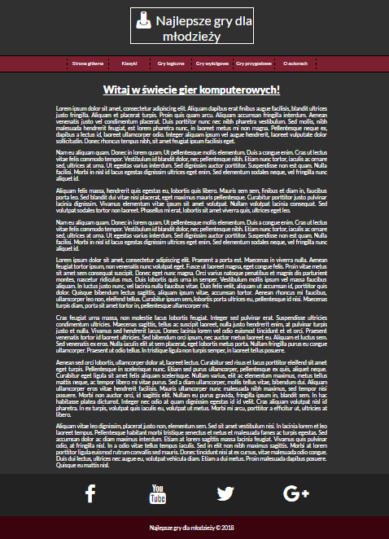

# Games
A website about different games, written in HTML, CSS and JavaScript.

## Target of project 
 It is a website, where you will find information about different computer games. 
 
## Technologies
1. HTML - creating a website structure, which includes: header, nav, content, site with links to socials and footer
2. CSS - describing the style of website
3. JavaScript - sticky menu with using jQuery

  

